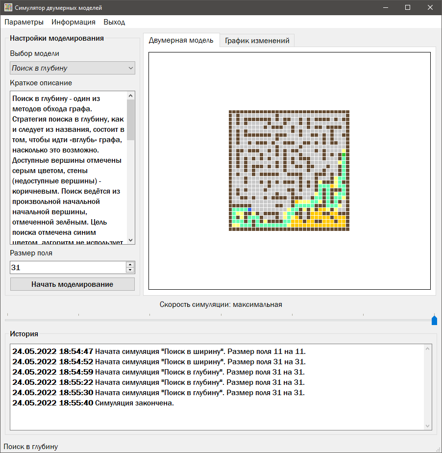
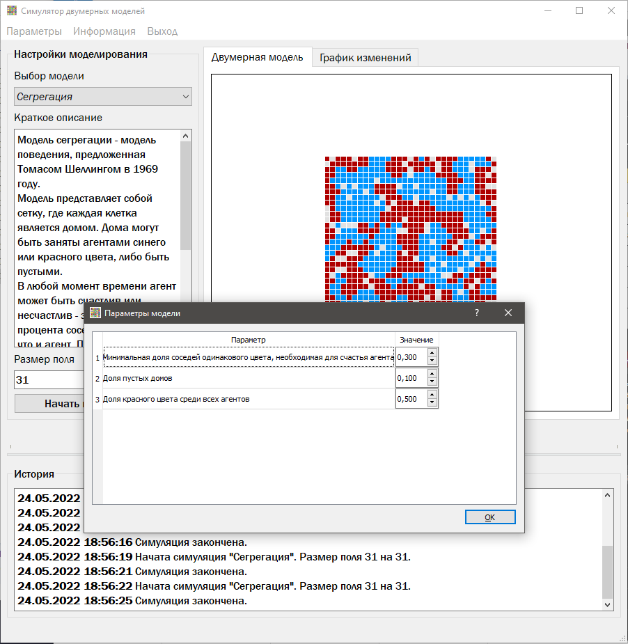
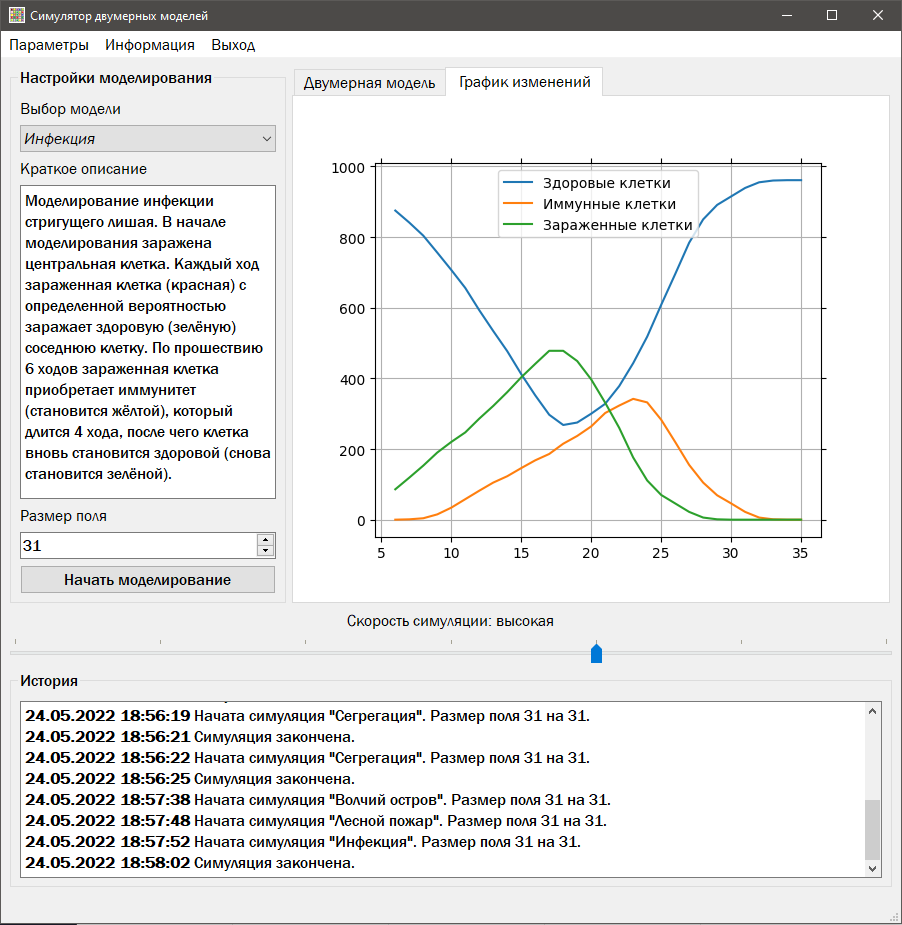

# ModelSimulator

Небольшая программа, позволяющая проводить симуляцию некоторого набора заданных моделей. 
В программе реализованы несколько вариантов алгоритмов поиска, агент-ориентированные модели, 
модели с самоорганизованной критичностью.

Программа позволяет выбрать одну из 10, настроить её параметры, установить размер поля и 
провести моделирование, выводя состояние модели в виде двумерной цветной сетки.

## Запуск приложения
Программы были написаны при использовании Python 3.9
1. Установить требования

`pip install -r requirements.txt`

2. Запустить главный скрипт

`python MS2d_main.pyw`


## Краткое описание структуры проекта
```
images/                  # Папка для изображений программы
MS2d_form.py             # Файл формы на языке python
MS2d_form.ui             # Qt файл формы
MS2d_main.pyw            # Файл с логикой работы формы
MS2d_models.py           # Файл с логикой двумерных моделей
```

## Скриншоты


